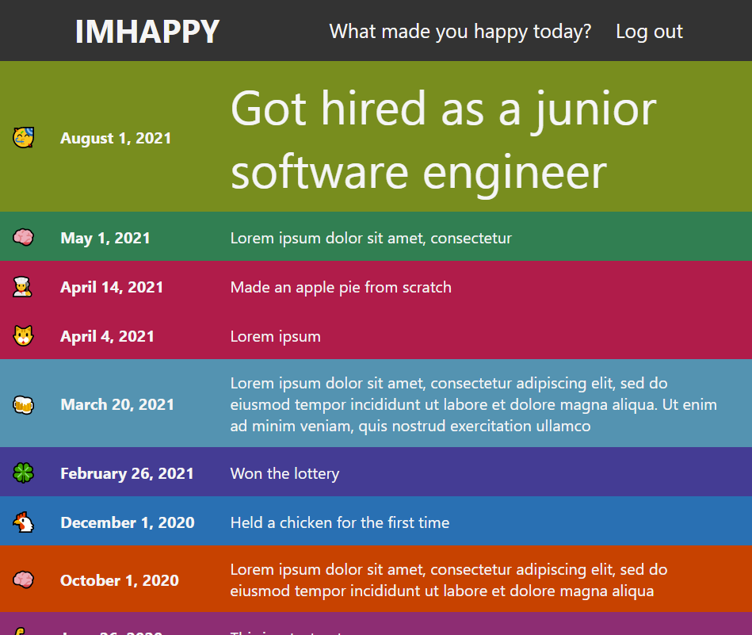
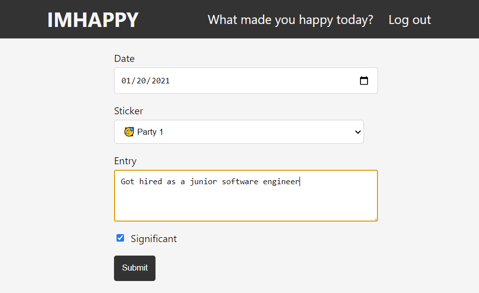

# IMHAPPY

IMHAPPY is a fullstack single-page web app with full CRUD functionality where users can journal happy moments of their life. The entries are then sorted into a colorful list in descending order. Whenever the user wants to improve their mood, they can open IMHAPPY and see a list of happy moments of their life. IMHAPPY also gives the user an easy way to remember more happy moments of their life.

- **Fullstack:** IMHAPPY was originally my frontend capstone and is now a fullstack app with a backend coded with .NET and SQL. The older version of IMHAPPY can be found [here](https://github.com/chrismccolgan/imhappy-old).
- **Colorful:** Every month for each entry has its own background color. The more entries the user makes, the more colorful the app becomes!
- **CRUD:** IMHAPPY entries contain full CRUD (Create, Read, Update, Delete) functionality.
- **Authentication:** IMHAPPY uses Google Firebase to manage user accounts and authentication.

Technologies used to create IMHAPPY include React, .NET, SQL, and Google Firebase.

## Screenshots

